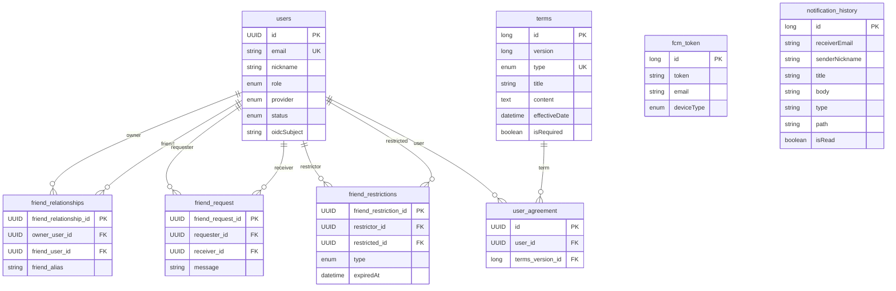

# DB Schema

DB 자체 DDL과 JPA 엔티티가 정의하는 바는 동일하다. JPA가 생성하는 네이밍이 읽기 친화적이지 않아 별도 DDL로 테이블을 정의한다.

## DDL (요약 — seed data 제외)

```sql
CREATE TABLE users
(
    id           CHAR(36)                                              NOT NULL,
    email        VARCHAR(255)                                          NOT NULL,
    nickname     VARCHAR(255)                                          NOT NULL,
    role         ENUM ('NORMAL', 'ADMIN')                              NOT NULL,
    provider     ENUM ('KAKAO', 'GOOGLE', 'NAVER')                     NOT NULL,
    status       ENUM ('PENDING', 'ACTIVE', 'BLOCKED', 'WITHDRAWN')    NOT NULL,
    oidc_subject VARCHAR(255)                                          NULL,
    created_at   DATETIME(6)                                           NOT NULL,
    updated_at   DATETIME(6)                                           NOT NULL,
    PRIMARY KEY (id),
    UNIQUE KEY uk_users_email (email),
    KEY idx_users_nickname (nickname)
);

CREATE TABLE terms
(
    id             BIGINT                                               NOT NULL AUTO_INCREMENT,
    version        BIGINT                                               NOT NULL,
    type           ENUM ('SERVICE', 'PRIVACY', 'LOCATION', 'MARKETING') NOT NULL,
    title          VARCHAR(255)                                         NOT NULL,
    content        TEXT                                                 NOT NULL,
    effective_date DATETIME(6)                                          NOT NULL,
    is_required    BIT(1)                                               NOT NULL,
    created_at     DATETIME(6)                                          NOT NULL,
    updated_at     DATETIME(6)                                          NOT NULL,
    created_by     VARCHAR(255)                                         NULL,
    updated_by     VARCHAR(255)                                         NULL,
    PRIMARY KEY (id),
    UNIQUE KEY uk_terms_type_version (type, version)
);

CREATE TABLE user_agreement
(
    id               CHAR(36)    NOT NULL,
    user_id          CHAR(36)    NOT NULL,
    terms_version_id BIGINT      NOT NULL,
    created_at       DATETIME(6) NOT NULL,
    updated_at       DATETIME(6) NOT NULL,
    PRIMARY KEY (id),
    CONSTRAINT fk_user_agreement_user FOREIGN KEY (user_id) REFERENCES users (id),
    CONSTRAINT fk_user_agreement_terms FOREIGN KEY (terms_version_id) REFERENCES terms (id)
);

CREATE TABLE friend_request
(
    friend_request_id CHAR(36)     NOT NULL,
    requester_id       CHAR(36)    NOT NULL,
    receiver_id         CHAR(36)   NOT NULL,
    message            VARCHAR(255) NOT NULL,
    created_at         DATETIME(6)  NOT NULL,
    updated_at         DATETIME(6)  NOT NULL,
    PRIMARY KEY (friend_request_id),
    CONSTRAINT fk_friend_request_requester FOREIGN KEY (requester_id) REFERENCES users (id),
    CONSTRAINT fk_friend_request_receiver FOREIGN KEY (receiver_id) REFERENCES users (id)
);

CREATE TABLE friend_restrictions
(
    friend_restriction_id CHAR(36) NOT NULL,
    restrictor_id         CHAR(36) NULL,
    restricted_id         CHAR(36) NULL,
    type                  ENUM ('BLOCK', 'REJECT') NOT NULL,
    expired_at            DATETIME(6)               NULL,
    created_at            DATETIME(6)               NOT NULL,
    updated_at            DATETIME(6)               NOT NULL,
    PRIMARY KEY (friend_restriction_id),
    CONSTRAINT fk_friend_restrictions_restrictor FOREIGN KEY (restrictor_id) REFERENCES users (id),
    CONSTRAINT fk_friend_restrictions_restricted FOREIGN KEY (restricted_id) REFERENCES users (id)
);

CREATE TABLE friend_relationships
(
    friend_relationship_id CHAR(36)    NOT NULL,
    owner_user_id          CHAR(36)    NOT NULL,
    friend_user_id         CHAR(36)    NOT NULL,
    friend_alias           VARCHAR(20) NOT NULL,
    created_at             DATETIME(6) NOT NULL,
    updated_at             DATETIME(6) NOT NULL,
    PRIMARY KEY (friend_relationship_id),
    UNIQUE KEY uk_owner_friend (owner_user_id, friend_user_id),
    CONSTRAINT fk_friend_relationships_owner FOREIGN KEY (owner_user_id) REFERENCES users (id),
    CONSTRAINT fk_friend_relationships_friend FOREIGN KEY (friend_user_id) REFERENCES users (id)
);

CREATE TABLE fcm_token
(
    id          BIGINT              NOT NULL AUTO_INCREMENT,
    token       VARCHAR(255)        NOT NULL,
    email       VARCHAR(255)        NOT NULL,
    device_type ENUM ('AOS', 'IOS') NOT NULL,
    created_at  DATETIME(6)         NOT NULL,
    updated_at  DATETIME(6)         NOT NULL,
    PRIMARY KEY (id)
);

CREATE TABLE notification_history
(
    id              BIGINT       NOT NULL AUTO_INCREMENT,
    receiver_email  VARCHAR(255) NOT NULL,
    sender_nickname VARCHAR(255) NOT NULL,
    title           VARCHAR(255) NOT NULL,
    body            VARCHAR(255) NOT NULL,
    type            VARCHAR(255) NOT NULL,
    path            VARCHAR(255) NULL,
    is_read         BIT(1)       NOT NULL,
    created_at      DATETIME(6)  NOT NULL,
    updated_at      DATETIME(6)  NOT NULL,
    PRIMARY KEY (id)
);

CREATE TABLE one_time_tokens
(
    token_value VARCHAR(255) NOT NULL,
    username    VARCHAR(255) NOT NULL,
    issued_at   TIMESTAMP    NOT NULL DEFAULT CURRENT_TIMESTAMP,
    expires_at  TIMESTAMP    NOT NULL,
    PRIMARY KEY (token_value)
);
```

> `users.provider`는 DDL상 `NAVER`도 허용하지만, 코드의 `OAuth2Provider` enum에는 `KAKAO`/`GOOGLE`만 정의되어 있다 — `NAVER`는 DB 레벨에만 존재하는 미사용 값이다.

## 공통 베이스 클래스

| 클래스 | 필드 | 용도 |
|---|---|---|
| `BaseTimeEntity` | createdAt, updatedAt | 대부분의 엔티티가 상속. JPA Auditing 자동 관리 |
| `BaseEntity` | createdAt, updatedAt, createdBy, updatedBy | 작성자 추적이 필요한 엔티티(`terms` 등) |

## ERD



## 테이블별 참고사항

- **`fcm_token.email`**: `users` 테이블에 대한 DB FK 제약이 없다 — 문자열로만 연결되는 약한 참조다.
- **`friend_relationships`**: 친구 요청 A→B 수락 시 `owner=A,friend=B`와 `owner=B,friend=A` 두 행을 동시에 넣는다. JOIN 없이 `owner_user_id` 기준 조회만으로 친구 목록을 가져올 수 있다.
- **`friend_restrictions.type`**: `REJECT`는 `expired_at = now() + 30일`, `BLOCK`은 `expired_at = null`(영구).
- **`notification_history.type`**: 실제 `NotificationType` enum 8종 — `FRIEND_REQUEST_RECEIVED`, `FRIEND_REQUEST_ACCEPTED`, `LOCATION_SHARE_RECEIVED`, `ARRIVAL`, `DEPARTURE`, `ARRIVAL_CONFIRMATION`, `TERMS_UPDATE_NOTICE`, `DELIVERY_RESULT_NOTICE`.
