# Flows

주요 기능의 시퀀스 다이어그램. Admin OTT 로그인 흐름은 [security.md](./security.md#admin-ott-one-time-token-로그인)에 있다.

## OIDC 로그인

`/api/auth/login`은 기존 사용자만 로그인시킨다 — 신규 유저를 만들지 않는다.

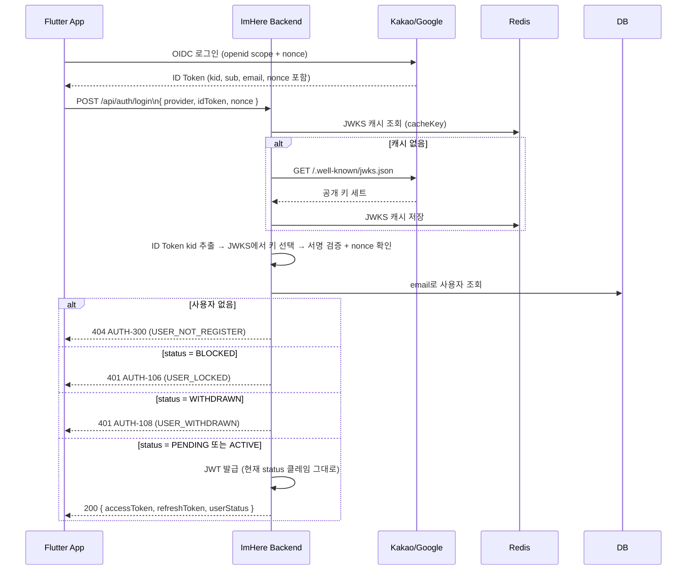

## OIDC 회원가입 + 회원 활성화

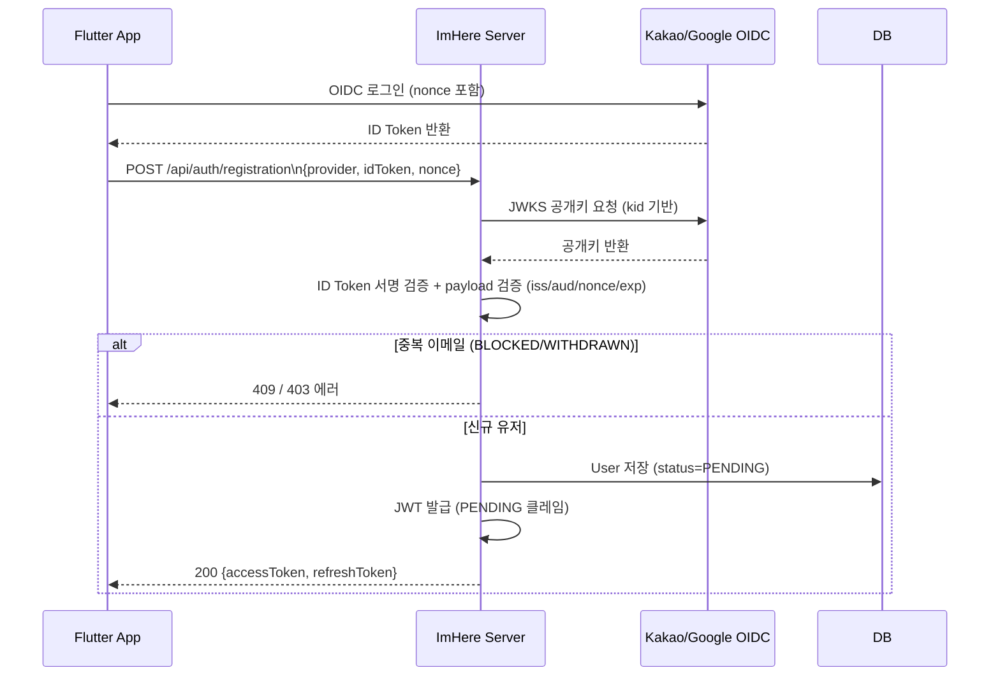

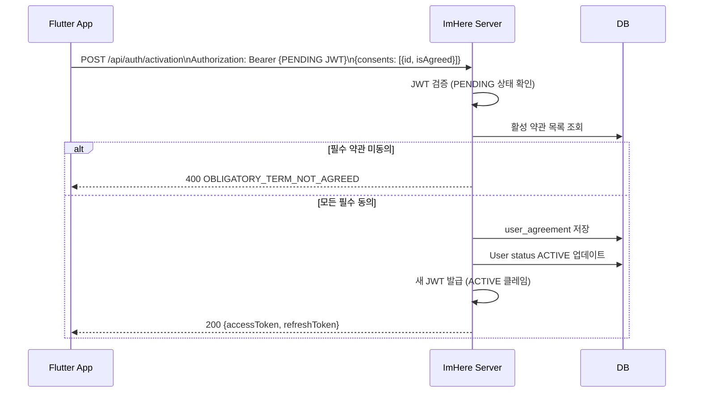

## JWT 토큰 갱신

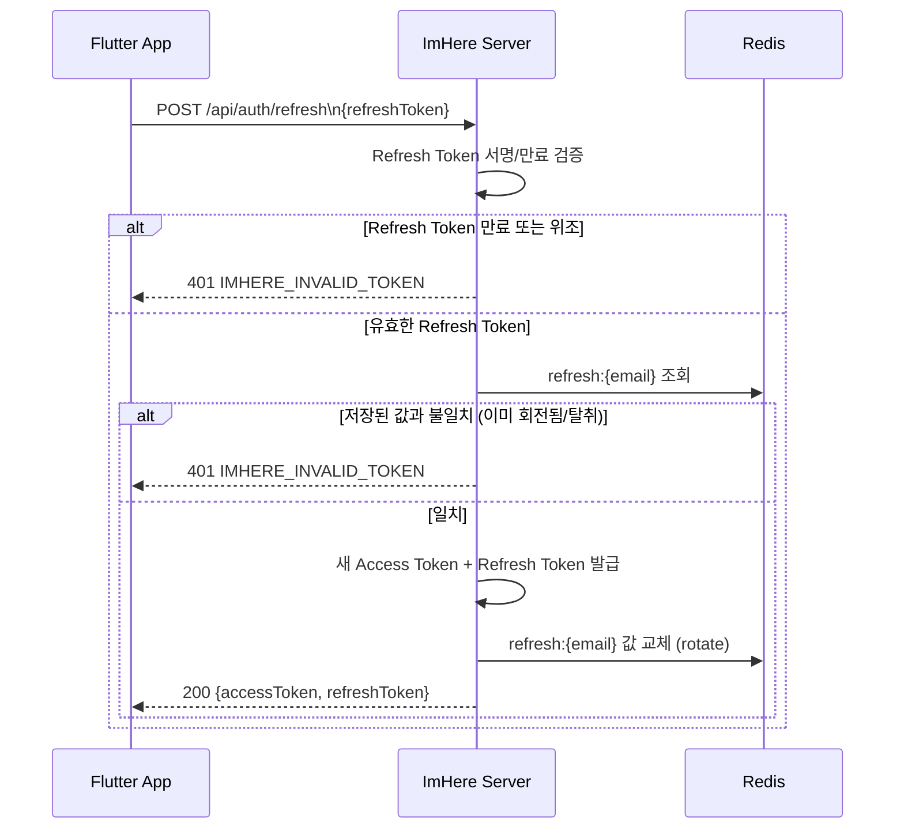

## 친구 요청 & 수락 / 거절

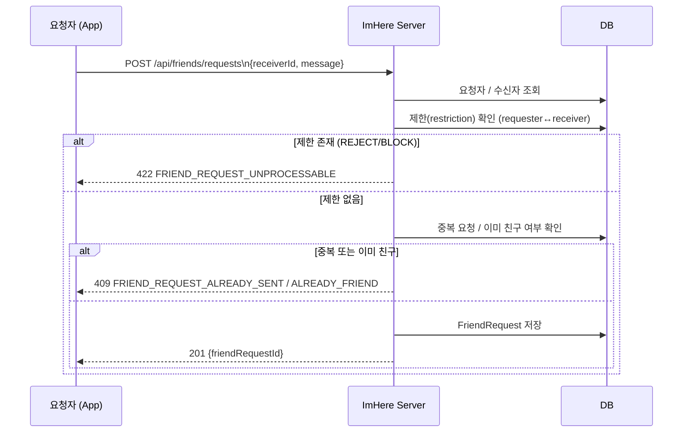

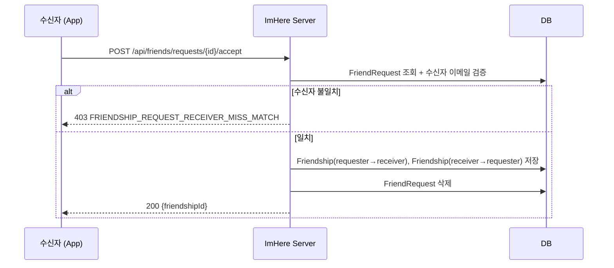

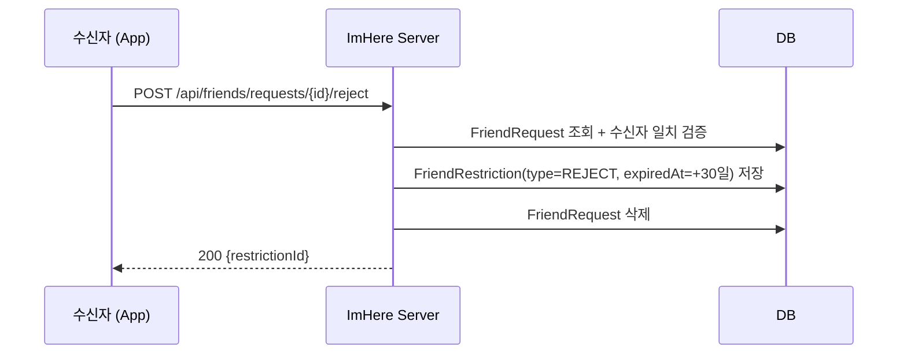

## 친구 차단 & 제한

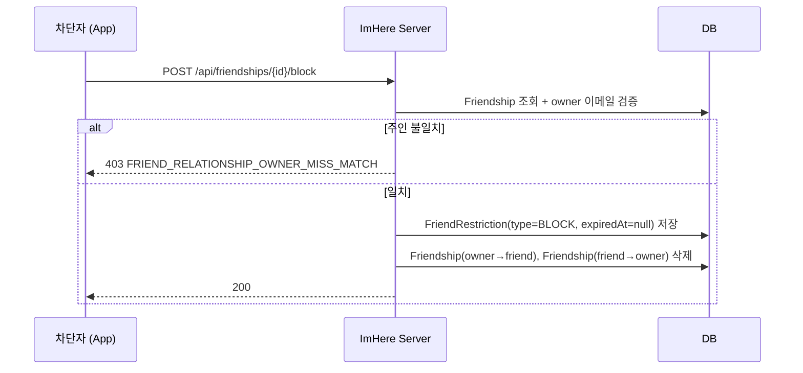

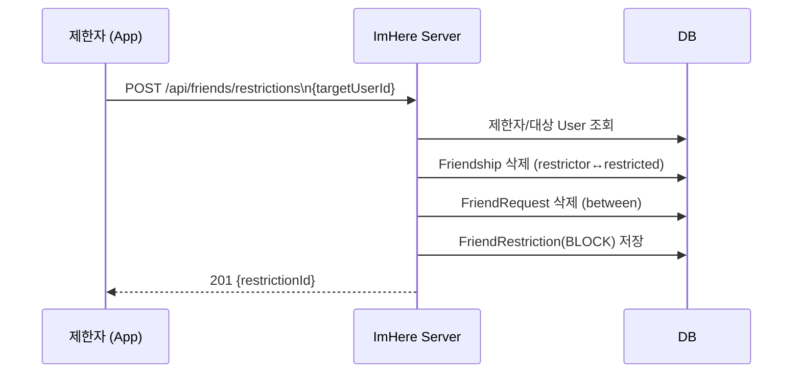

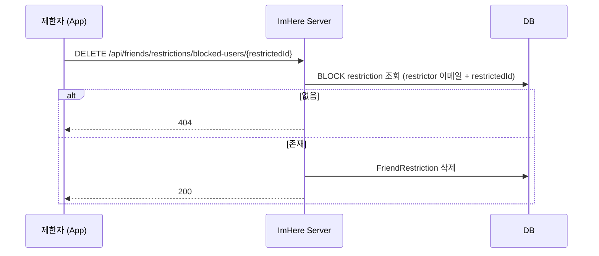

| 타입 | 만료 | 재요청 가능 여부 |
|---|---|---|
| REJECT | now + 30일 | 30일 후 다시 가능 |
| BLOCK | null(영구) | 해제하지 않는 한 불가 |

## FCM 토큰 등록 & 실패 체인

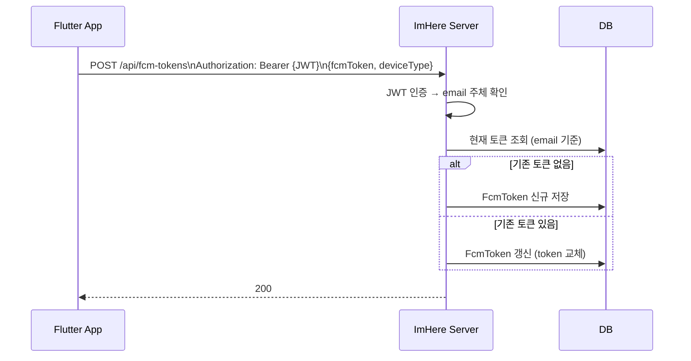

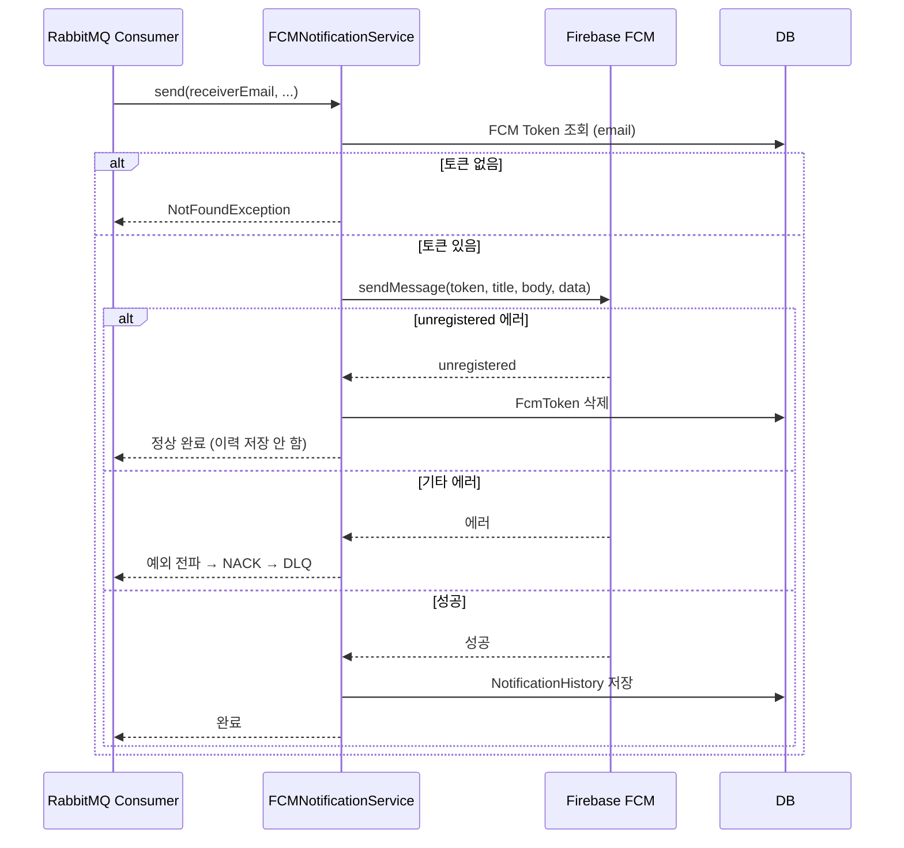

## 알림 발송 흐름 (MQ In → Out → DLQ 재시도)

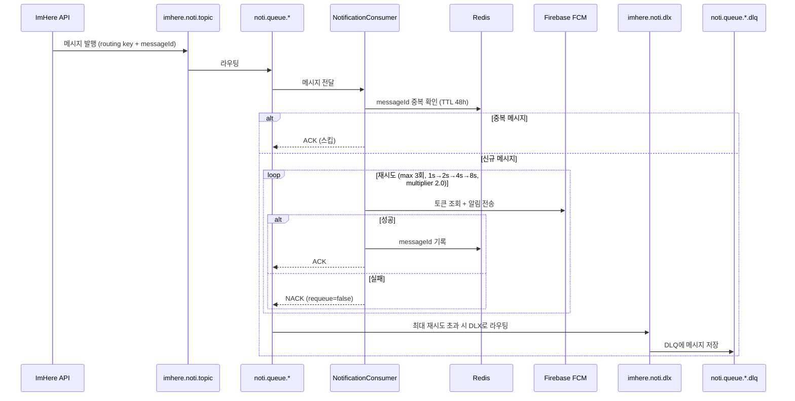

## RabbitMQ DLQ 재시도 & Admin Replay

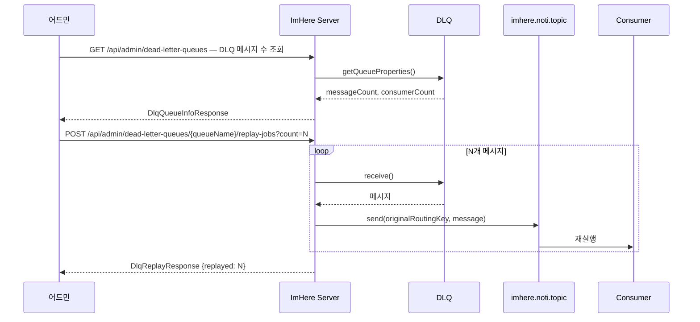

| Queue | DLX | DLQ |
|---|---|---|
| `noti.queue.friend` | `imhere.noti.dlx` | `noti.queue.friend.dlq` |
| `noti.queue.service` | `imhere.noti.dlx` | `noti.queue.service.dlq` |

재시도: 최대 3회, 1s→2s→4s→8s(multiplier 2.0). `setDefaultRequeueRejected(false)` + `RejectAndDontRequeueRecoverer` — 실패 시 큐에 다시 넣지 않고 DLQ로 보낸다.
