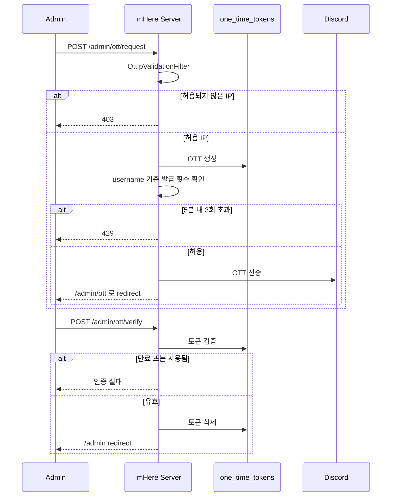

# Admin OTT 로그인 흐름

관리자 콘솔 접근 시 사용하는 One-Time Token 로그인 절차를 정리한 문서다. 모바일 JWT 흐름과 별개인 운영용 인증 체인이다.

---

## 핵심 판단

| 판단 | 내용 | 근거 |
|---|---|---|
| OTT 발급 전 IP 를 제한 | 요청 단계에서 허용 IP 가 아니면 즉시 차단한다 | 관리자 로그인 표면을 줄이기 위함이다 |
| OTT 는 Discord 전달을 전제 | 토큰은 내부 채널로 보내고, 사용자는 검증 단계에서 입력한다 | 평문 비밀번호 기반 운영 로그인을 피한다 |
| 성공 후 세션 로그인으로 전환 | OTT 검증 성공 시 관리자 웹은 세션 기반으로 들어간다 | 브라우저 관리 화면과 모바일 API 인증 모델을 분리한다 |

---

## 시퀀스

---

## 구현 포인트

1. IP 제한과 발급 횟수 제한은 다른 정책이다.
2. OTT 는 1회성이라 검증 성공 후 즉시 제거된다.
3. 관리자 로그인 성공 결과는 모바일 JWT 가 아니라 웹 세션이다.

---

## 코드 기준점

- `src/main/kotlin/com/kdongsu5509/auth/security/config/SecurityConfig.kt`
- `src/main/kotlin/com/kdongsu5509/auth/security/handler/ImHereOttSuccessHandler.kt`
- `src/main/kotlin/com/kdongsu5509/auth/security/handler/OttLoginSuccessHandler.kt`

---

## 연관 문서

- [../security/admin-ott.md](../security/admin-ott.md)
- [../security/README.md](../security/README.md)
- [practical-feature-flows.md](practical-feature-flows.md#8-setting--my-info--terms)
