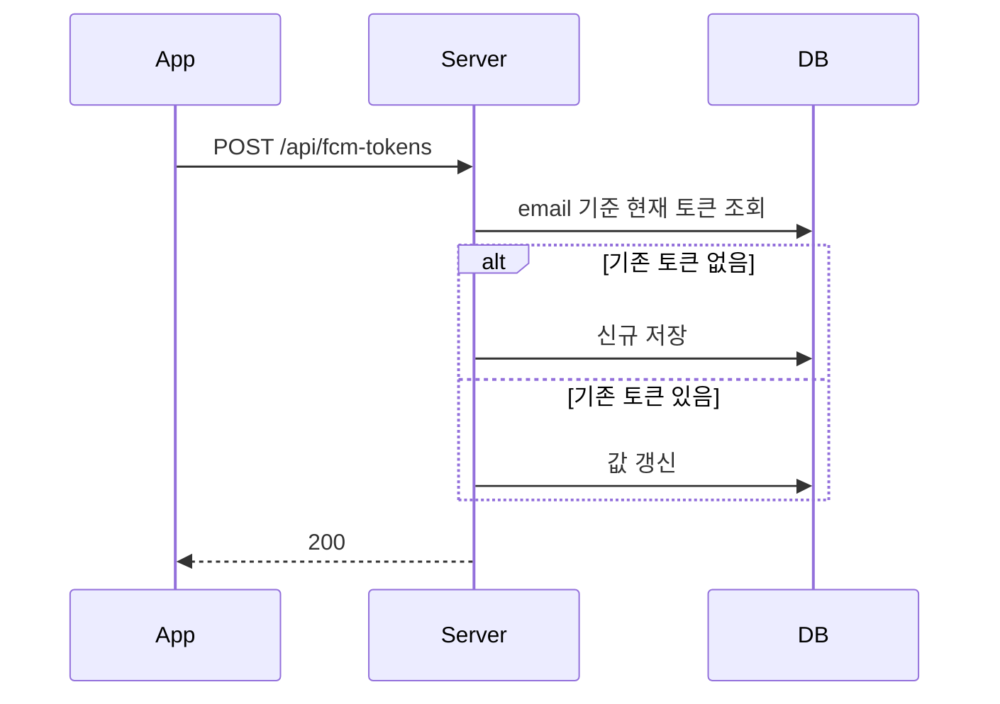
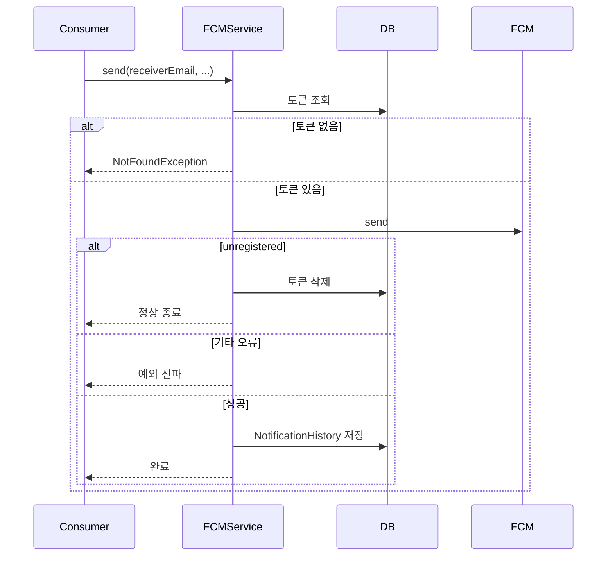

# FCM 토큰 등록 & 알림 전송 실패 체인

FCM 토큰을 사용자 기준으로 upsert 하는 과정과, 전송 실패 유형별 후속 처리 규칙을 정리한 문서다.

---

## 핵심 판단

| 판단 | 내용 | 근거 |
|---|---|---|
| FCM 토큰은 사용자 기준 upsert | email 기준 현재 토큰을 조회해 insert/update 한다 | 기기 교체나 토큰 재발급을 단순하게 처리한다 |
| `UNREGISTERED` 는 토큰 정리로 본다 | 재시도보다 토큰 삭제가 우선이다 | 더 이상 유효하지 않은 디바이스를 계속 치지 않기 위함이다 |
| 성공 시에만 이력을 저장 | `NotificationHistory` 는 실제 전송 성공 결과를 중심으로 남긴다 | 실패 이력과 성공 이력을 구분한다 |

---

## 토큰 등록

---

## 전송 실패 체인

---

## 구현 포인트

1. 토큰 등록 API 는 사실상 사용자별 최신 토큰 동기화 API 다.
2. `UNREGISTERED` 는 retry 가치가 낮아서 정리 동작으로 흘러간다.
3. 기타 전송 실패는 상위 MQ retry / DLQ 정책으로 넘긴다.

---

## 코드 기준점

- `src/main/kotlin/com/kdongsu5509/notifications/application/service/FcmTokenEnrollService.kt`
- `src/main/kotlin/com/kdongsu5509/notifications/application/service/FCMNotificationService.kt`

---

## 연관 문서

- [notification-pipeline.md](notification-pipeline.md)
- [rabbitmq-dlq-replay.md](rabbitmq-dlq-replay.md)
- [practical-feature-flows.md](practical-feature-flows.md#5-fcm-notification-lifecycle)
- [practical-feature-flows.md](practical-feature-flows.md#7-record--history)
