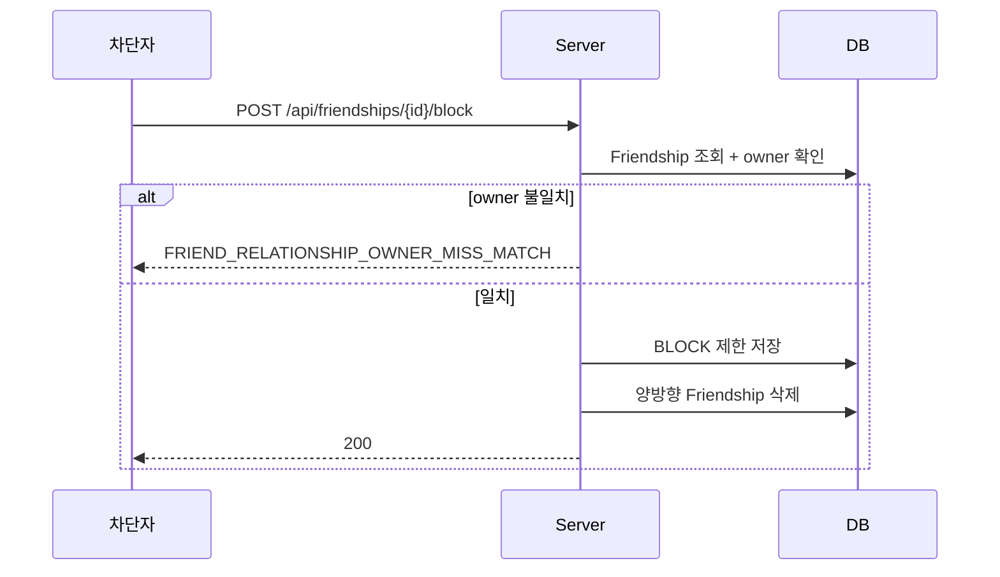
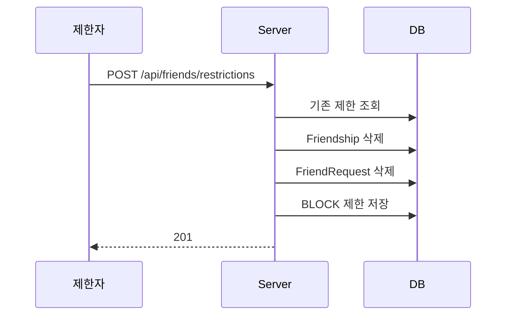
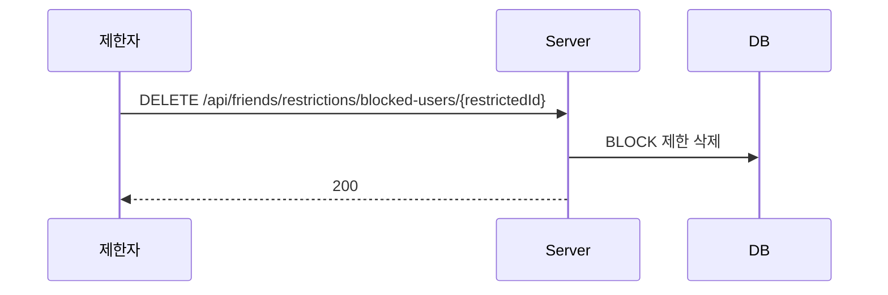

# 친구 차단 (Block) & 제한 흐름

친구 관계에서의 차단과, 직접 제한 레코드를 만드는 흐름을 정리한 문서다.

---

## 핵심 판단

| 판단 | 내용 | 근거 |
|---|---|---|
| 차단은 관계 종료와 제한 저장을 함께 수행 | 기존 친구 관계가 있으면 끊고 `BLOCK` 제한을 남긴다 | 관계 조회와 요청 차단을 동시에 만족해야 한다 |
| 직접 제한 생성도 허용 | 친구가 아니어도 제한 레코드를 바로 만들 수 있다 | 검색/추천 등 다른 진입점에서도 차단이 가능해야 한다 |
| `BLOCK` 은 지속 제한 | `REJECT` 와 달리 만료 없는 제한으로 본다 | 차단 해제 전까지 재접촉을 막는다 |

---

## 친구 관계에서 차단

---

## 직접 제한 생성

---

## 차단 해제

---

## 구현 포인트

1. 차단은 친구 관계 삭제보다 제한 저장이 더 핵심이다.
2. 직접 제한 생성은 기존 요청/관계를 먼저 정리한 뒤 제한을 남긴다.
3. 차단 해제는 곧바로 친구 복구가 아니라, 다시 요청 가능한 상태로만 되돌린다.

---

## 코드 기준점

- `src/main/kotlin/com/kdongsu5509/friends/service/FriendshipServiceImpl.kt`
- `src/main/kotlin/com/kdongsu5509/friends/service/FriendRestrictionServiceImpl.kt`

---

## 연관 문서

- [friend-request.md](friend-request.md)
- [notification-pipeline.md](notification-pipeline.md)
- [../architecture/domain.md](../architecture/domain.md)
- [practical-feature-flows.md](practical-feature-flows.md#6-friend--contact--restriction)
