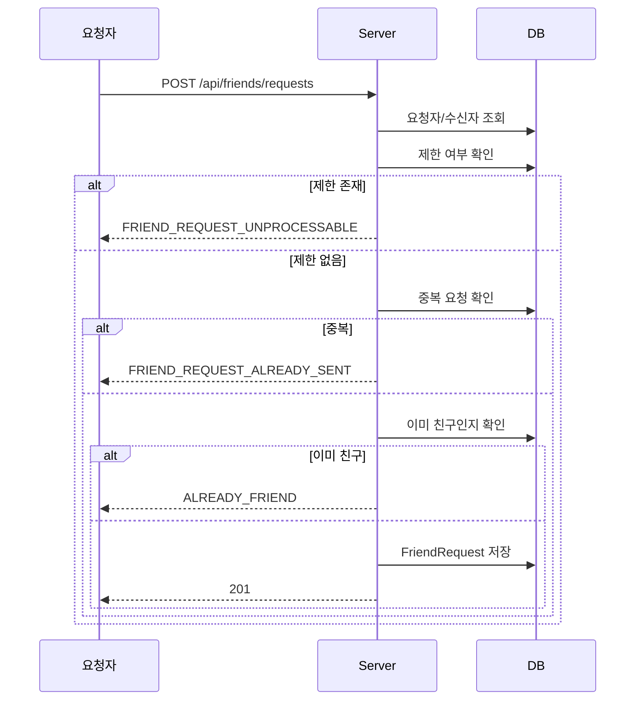
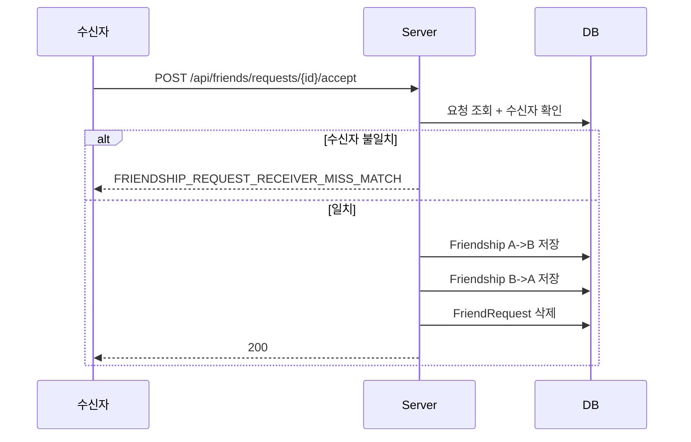
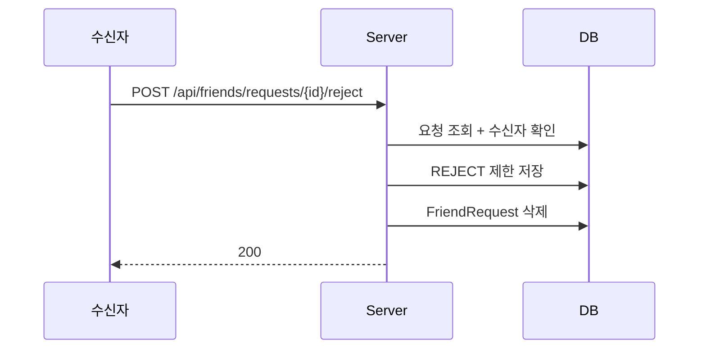

# 친구 요청 & 수락 / 거절 흐름

친구 요청 생성, 수락 시 관계 생성, 거절 시 제한 기록으로 남기는 흐름을 정리한 문서다.

---

## 핵심 판단

| 판단 | 내용 | 근거 |
|---|---|---|
| 요청과 친구 관계를 분리 | 요청 생성 후 수락 시점에만 `Friendship` 을 만든다 | pending 상태와 성립된 관계를 다르게 다루기 위함이다 |
| 거절은 단순 삭제가 아님 | 거절 시 `REJECT` 제한을 함께 남긴다 | 반복 요청을 제어하려는 정책이다 |
| 수락은 양방향 생성 | A-B, B-A 방향 모두 저장한다 | 조회와 권한 검증을 단순화한다 |

---

## 요청 생성

---

## 요청 수락

---

## 요청 거절

---

## 구현 포인트

1. 요청 거절은 단순히 없던 일로 만드는 게 아니라 제한 정책을 남긴다.
2. 수락 결과는 요청 상태 변경이 아니라 별도 관계 집합 생성이다.
3. 차단 흐름은 요청 흐름과 이어지지만 별도 정책 축으로 관리된다.

---

## 코드 기준점

- `src/main/kotlin/com/kdongsu5509/friends/service/FriendRequestServiceImpl.kt`

---

## 연관 문서

- [friend-block.md](friend-block.md)
- [notification-pipeline.md](notification-pipeline.md)
- [../architecture/domain.md](../architecture/domain.md)
- [practical-feature-flows.md](practical-feature-flows.md#6-friend--contact--restriction)
