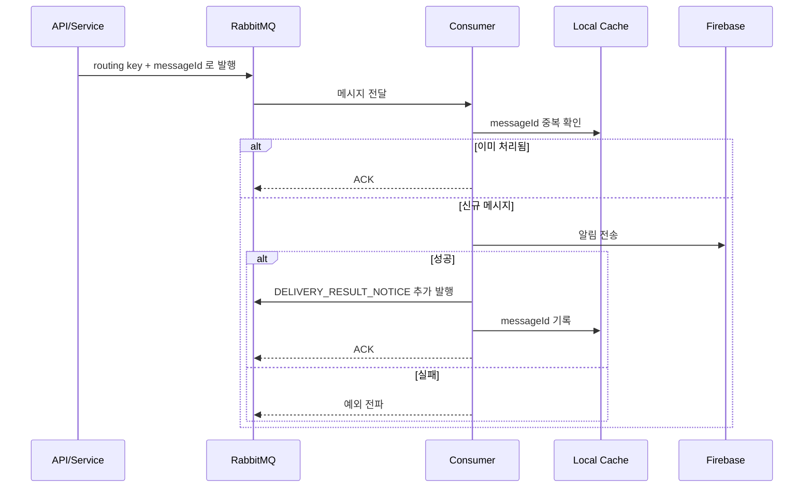

# 알림 발송 흐름

알림 이벤트가 큐에 들어가고, consumer 가 중복 제거와 FCM 전송을 수행한 뒤 결과를 남기는 기본 파이프라인을 정리한 문서다.

---

## 핵심 판단

| 판단 | 내용 | 근거 |
|---|---|---|
| 알림 발송은 비동기 처리 | API/service 는 MQ 에 발행하고 실제 전송은 consumer 가 담당한다 | HTTP 요청 지연과 FCM 장애를 분리한다 |
| 중복 제거를 consumer 앞단에서 수행 | `messageId` 기준으로 이미 처리한 메시지는 ACK 한다 | 재전송이나 중복 발행에 대한 방어가 필요하다 |
| 성공 결과도 별도 이벤트로 남김 | 전송 성공 후 `DELIVERY_RESULT_NOTICE` 를 추가 발행한다 | 이력 반영과 후속 처리 연결이 쉬워진다 |

---

## 시퀀스

---

## 주요 라우팅

| 항목 | 큐/익스체인지 |
|---|---|
| 친구 이벤트 | `noti.queue.friend` |
| 서비스 이벤트 | `noti.queue.service` |
| 메인 exchange | `imhere.noti.topic` |

---

## 구현 포인트

1. 중복 제거 책임은 `MessageIdempotencyService` 가 맡는다.
2. 전송 실패는 여기서 끝나지 않고 retry/DLQ 정책으로 이어진다.
3. 전송 성공도 후속 이력 반영을 위해 다시 이벤트화한다.

---

## 코드 기준점

- `src/main/kotlin/com/kdongsu5509/notifications/adapter/in/messageQueue/AbstractNotificationConsumer.kt`
- `src/main/kotlin/com/kdongsu5509/notifications/application/service/FCMNotificationService.kt`
- `src/main/kotlin/com/kdongsu5509/support/config/RabbitMQConfig.kt`

---

## 연관 문서

- [rabbitmq-dlq-replay.md](rabbitmq-dlq-replay.md)
- [fcm-token-failure-chain.md](fcm-token-failure-chain.md)
- [practical-feature-flows.md](practical-feature-flows.md#4-geofence-trigger--delivery--retry)
- [practical-feature-flows.md](practical-feature-flows.md#5-fcm-notification-lifecycle)
