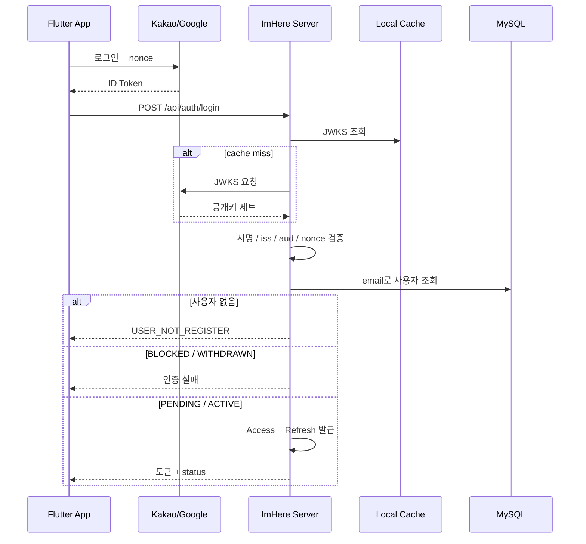

# Kakao / Google OIDC 로그인 흐름

`/api/auth/login`은 **기존 사용자 로그인만** 처리합니다. 신규 사용자는 생성하지 않습니다.

---

## 핵심 판단

| 결정 | 내용 | 근거 |
|---|---|---|
| 미가입 사용자는 로그인 거부 | 가입은 별도 `/registration` 흐름으로 분리 | `LoginService.kt:27` |
| `PENDING` 로그인 허용 | 약관 동의 화면으로 보내기 위해 토큰 발급 | `LoginService.kt:29` |
| OIDC 검증과 로그인 분리 | 검증은 `OIDCVerifyService`, 상태 판단은 `LoginService` | `OIDCVerifyService.kt:23`, `LoginService.kt:25` |

---

## 시퀀스



---

## 실제 요청 예시

```http
POST /api/auth/login
Content-Type: application/json

{
  "provider": "GOOGLE",
  "idToken": "eyJhbGciOiJSUzI1NiIsImtpZCI6I...",
  "nonce": "f85f7a3f"
}
```

---

## 주의점

* nonce는 필수입니다.
* email claim이 없으면 로그인할 수 없습니다.
* `PENDING`은 로그인 성공이지만 메인 화면 진입 조건은 아닙니다.

---

## 코드 근거

* OIDC 검증: `src/main/kotlin/com/kdongsu5509/auth/application/service/OIDCVerifyService.kt:23`
* 미가입 차단: `src/main/kotlin/com/kdongsu5509/auth/application/service/LoginService.kt:25`

---

## 관련 문서

* 신규 가입 / 활성화: [oidc-signup-activation.md](oidc-signup-activation.md)
* JWT 구조: [../security/jwt.md](../security/jwt.md)
* 앱 실전 흐름: [practical-feature-flows.md](practical-feature-flows.md#1-auth--login--terms)
