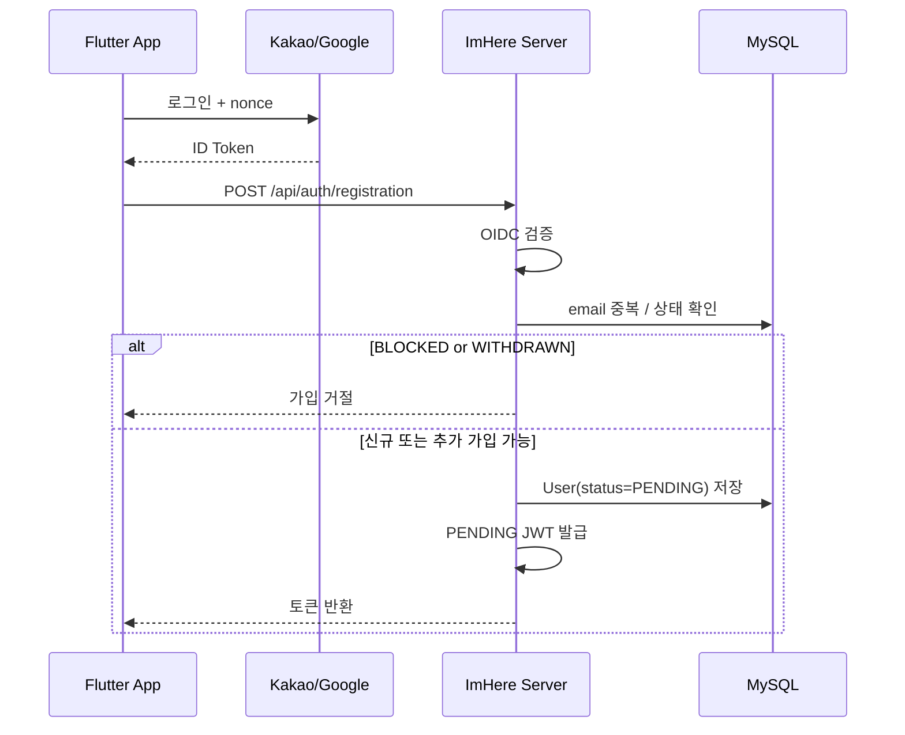
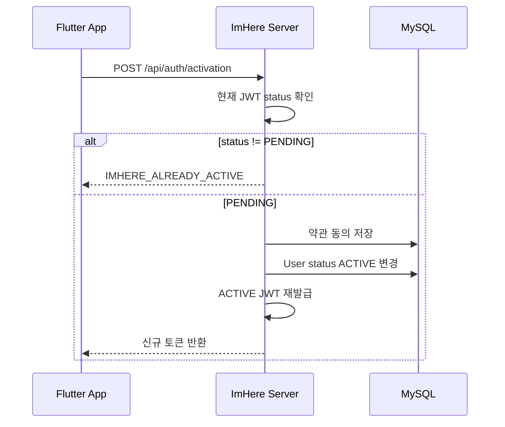

# OIDC 회원가입 + 회원 활성화 흐름

OIDC 로그인 뒤 신규 사용자를 `PENDING` 으로 만들고, 약관 동의가 끝난 시점에 `ACTIVE` 토큰으로 전환하는 흐름을 정리한 문서다.

---

## 핵심 판단

| 판단 | 내용 | 근거 |
|---|---|---|
| 가입과 활성화를 분리 | 회원가입 직후에는 `PENDING` 토큰을 돌려주고, 활성화 API 에서 최종 `ACTIVE` 전환을 한다 | 약관 동의 전 사용 범위를 명확히 제한하려는 설계다 |
| 약관 동의와 상태 변경을 함께 처리 | 활성화 시 `consentAll()` 과 상태 변경을 한 트랜잭션 축으로 다룬다 | 부분 성공 상태를 줄이기 위함이다 |
| 이미 활성화된 사용자는 재활성화하지 않음 | `ACTIVE` 사용자가 다시 activation API 를 호출하면 예외 처리한다 | 상태 전이를 단방향으로 유지한다 |

---

## 회원가입 시퀀스

---

## 활성화 시퀀스

---

## 구현 포인트

1. `PENDING` 은 로그인 실패 상태가 아니라 가입 후 미활성 상태다.
2. 활성화 API 는 단순 약관 저장이 아니라 사용자 상태 전이까지 책임진다.
3. 상태 전이 후 토큰도 같이 바뀌므로 클라이언트는 기존 토큰을 계속 쓰면 안 된다.

---

## 코드 기준점

- `src/main/kotlin/com/kdongsu5509/auth/application/service/RegisterService.kt`
- `src/main/kotlin/com/kdongsu5509/auth/application/service/ActivateUserService.kt`
- `src/main/kotlin/com/kdongsu5509/terms/`

---

## 연관 문서

- [../security/oauth.md](../security/oauth.md)
- [../security/jwt.md](../security/jwt.md)
- [oidc-login.md](oidc-login.md)
- [token-refresh.md](token-refresh.md)
- [practical-feature-flows.md](practical-feature-flows.md#1-auth--login--terms)
