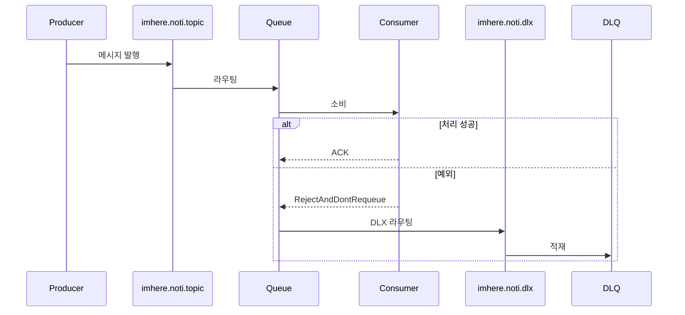
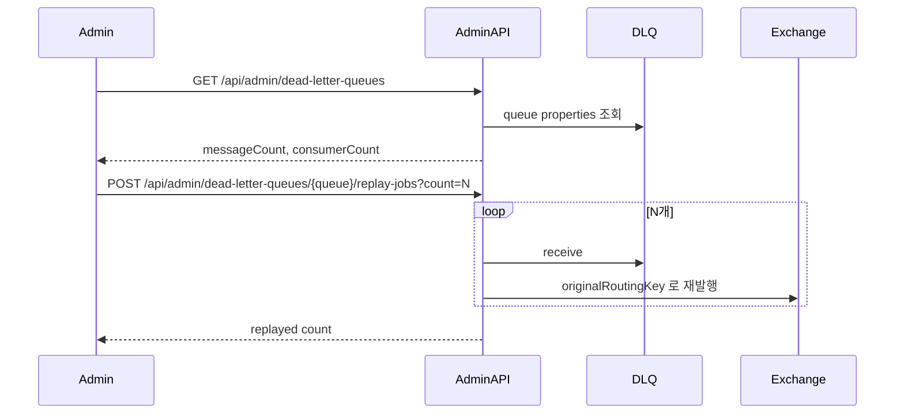

# RabbitMQ DLQ 재시도 & Admin Replay 흐름

consumer 실패 메시지가 DLQ 로 이동하는 과정과, 관리자가 이를 다시 원래 routing key 로 replay 하는 운영 흐름을 정리한 문서다.

---

## 핵심 판단

| 판단 | 내용 | 근거 |
|---|---|---|
| 자동 재시도와 DLQ 를 함께 사용 | 즉시 실패를 몇 차례 재시도한 뒤 최종 실패는 DLQ 에 적재한다 | 일시 장애와 영속 장애를 구분하려는 설계다 |
| reject 후 재큐잉은 하지 않음 | `defaultRequeueRejected = false` 로 두고 DLX 로 보낸다 | 무한 재처리를 막는다 |
| 운영 복구는 관리자 replay API 로 수행 | DLQ 조회와 지정 개수 replay 를 운영 API 로 노출한다 | 수동 복구를 코드화한다 |

---

## 실패 -> DLQ 이동

---

## 관리자 Replay

---

## 재시도 설정

| 항목 | 값 |
|---|---|
| `maxRetries` | `3` |
| initial interval | `1s` |
| multiplier | `2.0` |
| max interval | `8s` |
| `defaultRequeueRejected` | `false` |

---

## 구현 포인트

1. DLQ 는 실패 은닉이 아니라 운영 복구를 위한 보존 지점이다.
2. replay 는 새 메시지를 만드는 게 아니라 원래 routing key 로 되돌리는 성격이다.
3. 자동 재시도 한도를 넘긴 오류만 운영 개입 대상으로 남긴다.

---

## 코드 기준점

- `src/main/kotlin/com/kdongsu5509/support/config/RabbitMQConfig.kt`
- `src/main/kotlin/com/kdongsu5509/notifications/application/service/DlqAdminService.kt`

---

## 연관 문서

- [notification-pipeline.md](notification-pipeline.md)
- [fcm-token-failure-chain.md](fcm-token-failure-chain.md)
- [practical-feature-flows.md](practical-feature-flows.md#4-geofence-trigger--delivery--retry)
