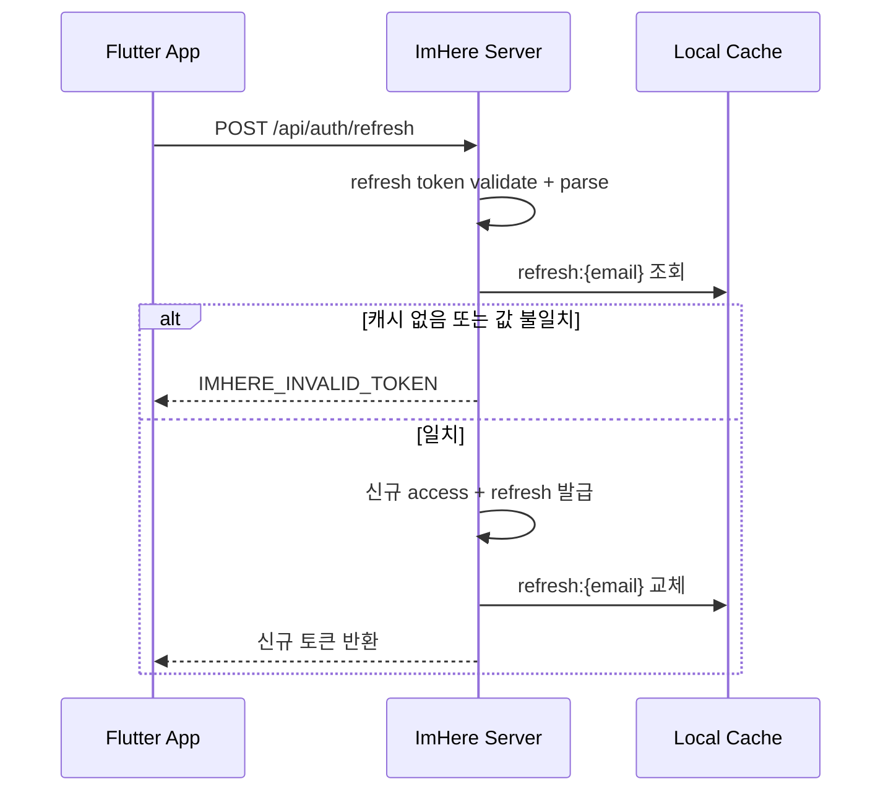
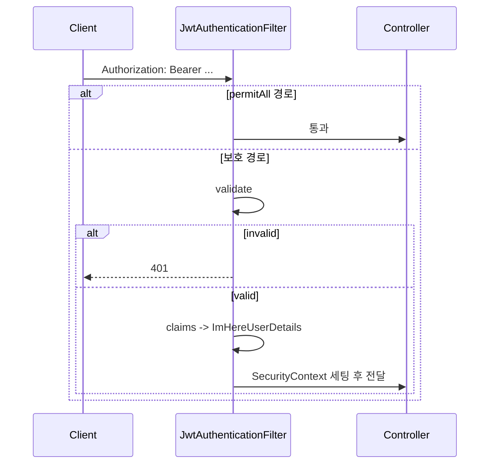

# JWT 토큰 갱신 흐름

refresh token 회전과 `JwtAuthenticationFilter` 기반 요청 인증 흐름을 함께 정리한 문서다.

---

## 핵심 판단

| 판단 | 내용 | 근거 |
|---|---|---|
| refresh token 은 캐시와 함께 검증 | 토큰 자체가 유효해도 `refresh:{email}` 값과 일치해야 통과한다 | 탈취 토큰 재사용을 줄이기 위한 설계다 |
| refresh 시 access/refresh 를 모두 재발급 | refresh 성공 시 둘 다 회전시킨다 | 단일 refresh token 장기 사용을 막는다 |
| 보호 API 인증은 필터에서 끝낸다 | 컨트롤러 진입 전에 JWT 검증과 `SecurityContext` 세팅을 마친다 | 비즈니스 레이어가 인증 세부사항을 알지 않게 한다 |

---

## Refresh 시퀀스

---

## 요청 인증 시퀀스

---

## 구현 포인트

1. 서버는 사용자당 하나의 refresh token 만 유효하다고 가정한다.
2. 캐시 값이 사라졌거나 덮어써졌다면 토큰 서명이 맞아도 실패 처리한다.
3. 필터 단계에서 인증이 끝나므로 컨트롤러는 인증 객체가 이미 있다고 전제한다.

---

## 코드 기준점

- `src/main/kotlin/com/kdongsu5509/auth/application/service/TokenRefreshService.kt`
- `src/main/kotlin/com/kdongsu5509/auth/adapter/out/jwt/ImHereTokenProviderAdapter.kt`
- `src/main/kotlin/com/kdongsu5509/auth/security/filter/JwtAuthenticationFilter.kt`
- `src/main/kotlin/com/kdongsu5509/auth/adapter/out/jwt/ImHereJwtProperties.kt`

---

## 연관 문서

- [../security/jwt.md](../security/jwt.md)
- [oidc-login.md](oidc-login.md)
- [oidc-signup-activation.md](oidc-signup-activation.md)
- [practical-feature-flows.md](practical-feature-flows.md#1-auth--login--terms)
