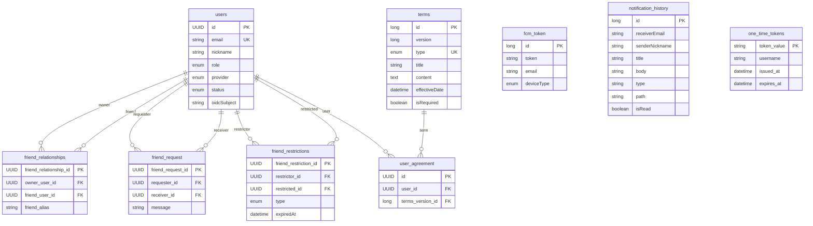

# DB Schema

DB 스키마는 JPA 엔티티와 동일한 구조를 유지합니다. 다만, JPA가 생성하는 DDL은 제약 조건과 네이밍을 한눈에 파악하기 어렵기 때문에 운영 환경에서는 명시적인 DDL을 사용합니다.

---

## 공통 엔티티

| 클래스              | 필드                                                 | 용도                                      |
|------------------|----------------------------------------------------|-----------------------------------------|
| `BaseTimeEntity` | `createdAt`, `updatedAt`                           | 대부분의 엔티티가 상속하며 JPA Auditing으로 자동 관리합니다. |
| `BaseEntity`     | `createdAt`, `updatedAt`, `createdBy`, `updatedBy` | 작성자 추적이 필요한 엔티티(`terms` 등)에서 사용합니다.     |

---

## ERD

---

## 테이블별 참고사항

### users

* 사용자의 기본 정보를 저장합니다.
* 현재 OAuth Provider는 `KAKAO`, `GOOGLE`만 지원합니다.

### terms

* 약관의 버전을 관리합니다.
* `(type, version)`을 Unique Key로 관리하여 동일한 약관 종류의 여러 버전을 저장할 수 있습니다.

### user_agreement

* 사용자가 동의한 약관 버전을 저장합니다.
* 약관이 변경되더라도 당시 동의한 버전을 추적할 수 있습니다.

### friend_request

* 친구 요청을 저장합니다.
* 요청자와 수신자 모두 `users`를 참조합니다.

### friend_relationships

* 친구 관계를 저장합니다.
* 친구 요청이 수락되면 `(A → B)`와 `(B → A)` 두 개의 레코드를 생성합니다.
* 이를 통해 `owner_user_id`만 조회하여 친구 목록을 가져올 수 있으며 Self Join이 필요하지 않습니다.

### friend_restrictions

* 사용자 차단 및 친구 요청 거절 정보를 저장합니다.
* `REJECT`는 `expired_at = now() + 30일`로 저장합니다.
* `BLOCK`은 `expired_at = NULL`로 저장하여 영구 차단을 의미합니다.

### fcm_token

* 모바일 기기의 FCM Token을 저장합니다.
* `users`와 Foreign Key를 연결하지 않고 이메일을 통한 약한 참조를 사용합니다.

### notification_history

* 사용자에게 발송한 알림 이력을 저장합니다.
* `type`에는 다음 `NotificationType`을 사용합니다.

    * `FRIEND_REQUEST_RECEIVED`
    * `FRIEND_REQUEST_ACCEPTED`
    * `LOCATION_SHARE_RECEIVED`
    * `ARRIVAL`
    * `DEPARTURE`
    * `ARRIVAL_CONFIRMATION`
    * `TERMS_UPDATE_NOTICE`
    * `DELIVERY_RESULT_NOTICE`
    * `DELIVERY_FAILED_NOTICE`

### one_time_tokens

* 일회용 인증 토큰을 저장합니다.
* 만료 시간을 기준으로 토큰의 유효성을 판단합니다.

---

## DDL

* DDL은 다음 파일에서 확인할 수 있습니다.

[DDL 파일](../../db/init/mysql/imhere-full-init.sql)
