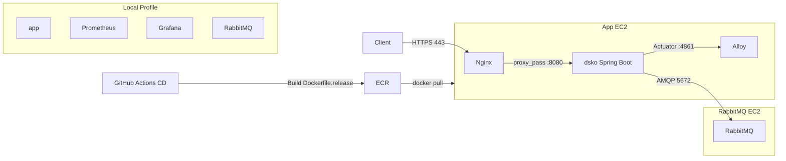

# Docker 구성

이 문서는 애플리케이션을 Docker로 실행하기 위한 이미지와 Compose Profile 구성을 설명합니다. Nginx 설정은 [nginx.md](nginx.md)를 참고합니다.

---

## 구성 파일

| 파일                                        | 용도                 |
|-------------------------------------------|--------------------|
| `Dockerfile`                              | 로컬 실행 및 검증용 이미지 빌드 |
| `Dockerfile.release`                      | 운영 배포용 이미지 빌드      |
| `docker-compose.yml`                      | 로컬/운영 컨테이너 실행 정의   |
| `infra/nginx/nginx.conf.template`         | 운영 Nginx 설정 템플릿    |
| `infra/alloy/alloy-config.alloy.template` | 운영 Alloy 설정 템플릿    |

---

## Dockerfile

### `Dockerfile`

로컬 실행과 이미지 검증을 위한 Dockerfile입니다.

멀티 스테이지 빌드를 사용합니다.

* `builder` 단계에서 `./gradlew build -x test`로 JAR를 생성합니다.
* `runtime` 단계에서는 실행에 필요한 JAR만 복사합니다.
* 최종 이미지에는 Gradle, 소스 코드, 빌드 캐시가 포함되지 않습니다.

```text
builder stage
  → Gradle build
  → JAR 생성

runtime stage
  → JAR 복사
  → Spring Boot 실행
```

---

### `Dockerfile.release`

운영 배포용 Dockerfile입니다.

CI/CD에서 이미 생성한 JAR를 그대로 이미지에 포함합니다.

* Gradle 빌드 단계를 포함하지 않습니다.
* CI에서 검증된 JAR를 재사용합니다.
* 이미지 빌드 시간이 짧고, 운영 이미지 구성이 단순합니다.
* `8080`, `4861` 포트를 노출합니다.

```text
CI/CD
  → ./gradlew bootJar -x test
  → build/libs/*.jar 생성
  → Dockerfile.release에서 app.jar로 복사
  → ECR Push
```

---

## Docker Compose

`docker-compose.yml`은 로컬과 운영에서 함께 사용하는 단일 Compose 파일입니다.

실행 환경은 `profile`로 구분합니다.

| Profile | 서비스                            | 용도                  |
|---------|--------------------------------|---------------------|
| `local` | `app`, `prometheus`, `grafana` | 로컬 애플리케이션 및 모니터링 실행 |
| `infra` | `rabbitmq`                     | 로컬 RabbitMQ 실행      |
| `prod`  | `dsko`, `nginx`, `alloy`       | 운영 애플리케이션 실행        |

---

## 로컬 실행 구성

로컬에서는 Spring Boot 애플리케이션과 RabbitMQ, Prometheus, Grafana를 Docker Compose로 실행할 수 있습니다.

```bash
# RabbitMQ만 실행
docker compose --profile infra up -d

# 애플리케이션 + Prometheus + Grafana 실행
docker compose --profile local up -d

# 전체 로컬 환경 실행
docker compose --profile local --profile infra up -d
```

직접 실행도 가능합니다.

```bash
./gradlew bootRun
```

테스트는 Docker 실행과 별도로 Gradle에서 수행합니다.

```bash
./gradlew test
```

---

## 운영 실행 구성

운영 앱 서버에서는 `prod` profile만 실행합니다.

```bash
docker compose --profile prod up -d
```

운영 앱 서버에서 실행되는 컨테이너는 다음과 같습니다.

| 서비스     | 역할                        |
|---------|---------------------------|
| `dsko`  | Spring Boot 애플리케이션        |
| `nginx` | HTTPS 진입점 및 Reverse Proxy |
| `alloy` | 로그, 메트릭, 트레이스 수집          |

RabbitMQ는 앱 서버의 Compose에서 실행하지 않습니다. 별도의 EC2에서 UserData를 통해 실행합니다.

---

## 포트 구성

| 포트      | 서비스                    | 공개 여부 | 용도                     |
|---------|------------------------|-------|------------------------|
| `443`   | Nginx                  | 외부 공개 | HTTPS 요청 진입점           |
| `8080`  | Spring Boot            | 내부 전용 | 애플리케이션 API             |
| `4861`  | Spring Boot Management | 내부 전용 | Actuator / 관리 포트       |
| `9090`  | Prometheus             | 로컬 전용 | 메트릭 수집                 |
| `3000`  | Grafana                | 로컬 전용 | 모니터링 대시보드              |
| `5672`  | RabbitMQ               | 내부 전용 | AMQP                   |
| `15672` | RabbitMQ               | 내부 전용 | RabbitMQ Management UI |

운영 환경에서 외부 요청은 `443` 포트로만 들어옵니다. Spring Boot의 `8080` 포트는 Nginx 뒤에서만 사용합니다.

---

## Nginx

운영 환경에서는 Nginx가 외부 요청의 진입점 역할을 합니다. 경로별 라우팅, CORS 처리, 인증서 갱신 등 상세 설정은 [nginx.md](nginx.md)에서 다룹니다.

---

## 운영 이미지 배포 흐름

운영 이미지는 GitHub Actions CD에서 생성하고 ECR에 Push합니다. CD의 Job별 동작과 환경 변수 설정 방법은 [cicd.md](cicd.md)에서 자세히 다룹니다.

```text
GitHub Actions CD
  → ./gradlew bootJar -x test
  → Dockerfile.release로 이미지 빌드
  → ECR Push
  → 앱 EC2에서 ECR Pull
  → docker compose --profile prod up -d
```

운영에서는 서버에서 직접 Gradle 빌드를 수행하지 않습니다.
CI/CD에서 검증된 JAR와 Docker 이미지만 서버로 배포합니다.

---

## 구성도



---

## 관련 문서

* Nginx 라우팅/CORS/인증서 설정은 `nginx.md`를 참고합니다.
* 가비아 DNS와 MySQL 호스팅은 `gabia.md`를 참고합니다.
* AWS 인프라 구성은 `aws.md`를 참고합니다.
* CI/CD 파이프라인과 환경 변수 설정은 `cicd.md`를 참고합니다.
