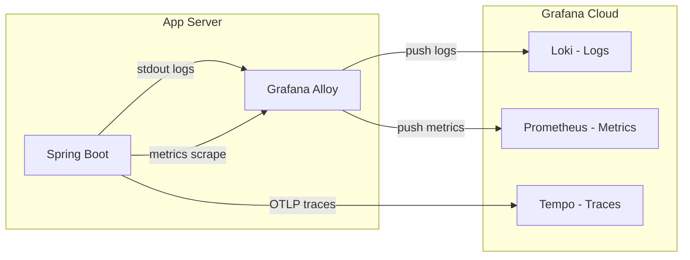

# 관측성 (Observability) 가이드

ImHere 프로젝트의 시스템 상태 모니터링, 로그 수집, 분산 트래킹 구성을 정리한 문서입니다.
모든 데이터는 **Grafana Cloud**로 통합됩니다.

---

## 1. 아키텍처 개요

애플리케이션 서버 내의 **Grafana Alloy**가 로그와 메트릭을 수집하여 전송하며, 트레이스는 앱에서 직접 전송합니다.

---

## 2. 주요 구성 요소

### 2.1 Prometheus (Metrics)

시스템 성능 및 상태 지표를 수집합니다.

- **수집 방식**: Alloy가 앱의 management 포트(`4861`)에 노출된 Prometheus 엔드포인트를 주기적으로 Scrape.
- **엔드포인트 경로**: 노출면 축소를 위해 `management.endpoints.web.base-path`를 난수화하여 운영에 적용합니다. 실제 경로는 `APP_MONITORING_YAML` 시크릿으로 주입되며, 동일한 값이 `alloy-config.alloy`의 `metrics_path`와 일치해야 합니다.
- **주요 지표**: JVM 상태(Memory, GC), HTTP 요청 수, 응답 시간, 에러율, 커넥션 풀 상태 등.

### 2.2 Loki (Logs)

Docker 컨테이너의 구조화된 로그를 수집합니다.

- **로그 형식**: `ECS JSON` (Elastic Common Schema)으로 구조화되어 전송됩니다.
- **수집 방식**: Alloy가 호스트의 `/var/run/docker.sock`을 통해 컨테이너의 stdout 로그를 직접 tail링합니다.

### 2.3 Tempo (Traces)

분산 환경에서의 요청 흐름과 지연 시간을 추적합니다.

- **로그 형식**: `OTLP` (OpenTelemetry Protocol).
- **수집 방식**: Spring Boot 내의 OpenTelemetry SDK가 직접 Grafana Cloud Tempo 엔드포인트로 push합니다.

---

## 3. 관리 및 설정

### 3.1 Grafana Alloy 설정

프로젝트 루트의 `alloy-config.alloy` 파일에 수집 및 전송 로직이 정의되어 있습니다.

- 로그 수집 시 컨테이너 이름을 라벨로 자동 매핑합니다.
- 보안을 위해 모든 엔드포인트 및 인증 키는 환경변수로 관리합니다.

### 3.2 디버깅 및 로컬 확인

- **Alloy UI**: `http://localhost:12345` (SSH 터널링 필요)에서 수집 상태를 실시간으로 확인할 수 있습니다.
- **Actuator**: management 포트 `4861`의 Prometheus 엔드포인트(`<base-path>/prometheus`)에서 원본 메트릭 데이터를 확인할 수 있습니다. base-path는 `application-monitoring.yaml`(운영은 시크릿)에 정의됩니다.

---

## 4. 트러블슈팅

| 증상         | 확인 사항                                                              |
|------------|--------------------------------------------------------------------|
| 로그가 보이지 않음 | `docker logs alloy-container`에서 Loki 전송 실패 여부 확인. Docker 소켓 권한 확인. |
| 메트릭 누락     | App의 관리 포트(4861) 활성화 여부 및 Alloy의 scrape 설정 확인.                     |
| 트레이스 연결 끊김 | 앱의 `.env` 내 `GRAFANA_CLOUD_TEMPO_ENDPOINT` 및 `AUTH_BASE64` 값 확인.   |
