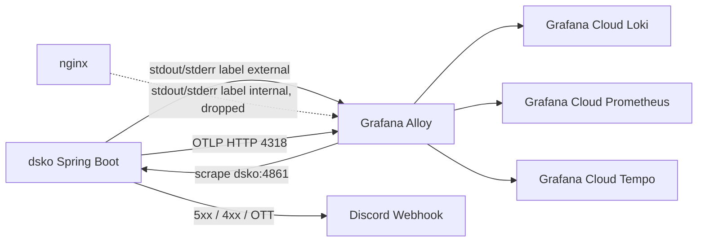

# Observability

ImHere Server의 관측 경로는 두 갈래로 나뉩니다.

- 로그, 메트릭, 트레이스 수집: Grafana Alloy -> Grafana Cloud
- 운영 이벤트 알림: Discord Webhook

**핵심 원칙**
Spring Boot 앱은 Grafana Cloud와 직접 통신하지 않고, Alloy만 외부 observability backend와 통신한다.

## 파이프라인

```text
[Docker stdout/stderr] -> [Alloy] -> Grafana Cloud Loki
[dsko:4861/{MGMT_BASE_PATH}/prometheus] -> [Alloy] -> Grafana Cloud Prometheus
[Spring Boot OTLP HTTP] -> [Alloy] -> Grafana Cloud Tempo
[Application exceptions / OTT events] -> [Discord Webhook]
```



메트릭은 Alloy가 `dsko:4861`을 30초마다 scrape 하는 pull 구조이므로 화살표 방향이 Alloy -> App입니다. 로그는 `imhere_log_scope` 라벨로 거르며, `internal`(
nginx, alloy)은 Alloy가 Docker socket으로 읽어도 keep 규칙에서 제외됩니다(`signals.md` 참고).

## 무엇을 읽어야 하나

- [signals.md](./signals.md)
    - 로그, 메트릭, 트레이스가 각각 어디서 들어와 어디로 나가는지를 다룹니다.
- [runtime-config.md](./runtime-config.md)
    - `application.yaml`, `prod.env`, `docker-compose.yml`, Alloy template가 언제 어떻게 연결되는지를 다룹니다.
- [alerts-discord.md](./alerts-discord.md)
    - Discord 운영 알림이 어떤 코드 경로에서 나가는지를 다룹니다.

## 현재 구조에서 중요한 점

- `docker-compose.yml`의 `prod` profile은 `dsko`, `nginx`, `alloy`를 같은 네트워크에 올립니다.
- `application.yaml`의 prod profile은 OTLP endpoint를 `http://alloy:4318/v1/traces`로 override 합니다.
- `infra/alloy/alloy-config.alloy.template`는 `prod.env`에서 `MGMT_BASE_PATH`, `GRAFANA_CLOUD_*` 값을 읽습니다.
- Discord는 Grafana Cloud와 별개인 운영 알림 채널입니다. Grafana Cloud는 조회/대시보드/장기 보존을 맡고, Discord는 5xx·비정상 접근·관리자 OTT처럼 사람이 즉시 알아야 하는
  이벤트만 push 합니다. 두 경로를 합치지 않은 이유는 알림 누락을 피하기 위해서입니다 — Grafana Cloud alert rule에 의존하면 수집 지연이나 쿼리 평가 주기만큼 통지가 늦지만, 앱이
  webhook을 직접 쏘면 요청 처리 시점에 바로 나가기 때문입니다.
