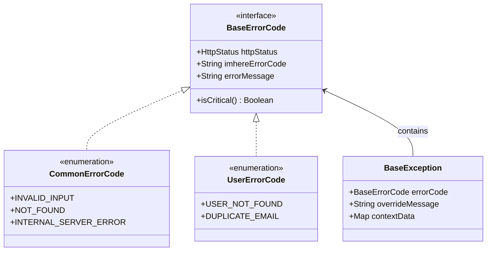
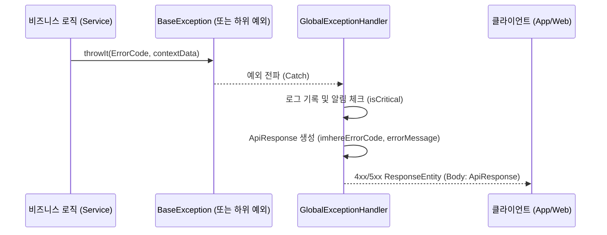
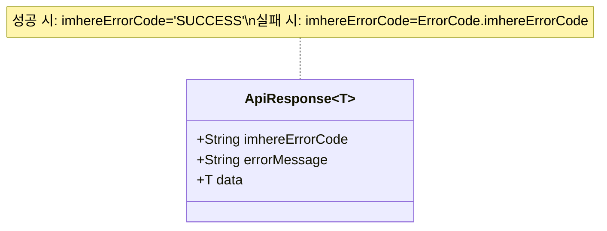

# 전역 예외 처리 및 API 응답 구조 리팩토링 상세 설계서

본 문서는 현재 시스템의 예외 처리 및 API 응답 구조에서 발생하는 로직 중복, 데이터 중복, 네이밍 혼선 문제를 해결하기 위한 3가지 리팩토링 방안을 제안합니다.

---

## 1. 현황 및 문제점 (Current Issues)

1.  **로직 중복:** `throwIt` 확장 함수, 개별 Exception 클래스, Enum 내부에 예외 생성 및 매핑 로직이 파편화되어 있음.
2.  **데이터 중복:** 
    *   에러 코드: `globalCode`(ErrorReason), `businessCode`(BusinessCode)로 이원화되어 관리됨.
    *   에러 메시지: `message`, `defaultMessage`, `customMessage` 등이 여러 레이어에서 중복 소유됨.
3.  **네이밍 혼선:** 동일한 역할을 하는 필드가 `errorCategory`, `errorCode`, `reason` 등 서로 다른 이름으로 불림.

---

## 2. 공통 개선 원칙 (Common Principles)

모든 방안은 아래의 **변수명 통일 원칙**을 엄격히 준수합니다.
*   **`imhereErrorCode`**: 에러를 식별하는 고유 코드 (기존 globalCode, businessCode, code 통합)
*   **`errorMessage`**: 사용자/클라이언트에게 전달할 에러 메시지 (기존 message 대체)
*   **`httpStatus`**: 반환할 HTTP 상태 코드
*   **`contextData`**: 에러와 관련된 추가 컨텍스트 데이터 (기존 metadata, stackTrace 대체)

---

## 3. 리팩토링 접근 방안 (3 Approaches)

### 방안 1: 완전 통합형 인터페이스 도입 (추천 🌟)

가장 표준적이고 확장성이 좋은 방식입니다. 모든 에러(공통/도메인)를 하나의 인터페이스로 묶습니다.

*   **구조:**
    *   `BaseErrorCode` 인터페이스 정의 (`httpStatus`, `imhereErrorCode`, `errorMessage`).
    *   `CommonErrorCode` (공통), `UserErrorCode` (도메인) 등 모든 Enum이 이를 구현.
    *   `BaseException`은 오직 `BaseErrorCode` 하나만 인자로 받아 모든 정보를 추출.
*   **장점:** 의존성 방향이 한 곳으로 모이며, 새로운 도메인 에러 추가 시 인터페이스만 구현하면 즉시 시스템에 편입됨.
*   **단점:** 기존의 `ErrorReason`, `BusinessCode` 관련 코드를 전면 수정해야 함.

### 방안 2: Sealed Interface 기반 계층 구조

Kotlin의 Sealed 특성을 활용하여 컴파일 타임에 에러 처리를 강제하는 방식입니다.

*   **구조:**
    *   `sealed interface ErrorCode` 하위에 공통 에러와 도메인별 에러를 계층적으로 선언.
    *   `GlobalExceptionHandler`에서 `when` 식을 사용하여 모든 에러 케이스를 누락 없이 처리.
*   **장점:** 타입 안정성이 매우 높으며, 특정 도메인의 에러 처리가 누락되는 것을 컴파일러가 잡아줌.
*   **단점:** 에러가 늘어날수록 Sealed 클래스 구조가 복잡해질 수 있으며, 전통적인 Spring 방식보다 코드가 장황해질 수 있음.

### 방안 3: 어댑터(Facade) 패턴을 통한 최소 변경

기존의 Enum 구조를 유지하면서, 응답 직전에만 데이터를 변환하여 노출하는 방식입니다.

*   **구조:**
    *   기존 `ErrorReason`, `BusinessCode`는 그대로 유지 (내부 로직용).
    *   `ErrorConverter` 혹은 래퍼 클래스를 도입하여 외부 응답(API)으로 나갈 때만 `imhereErrorCode`, `errorMessage`로 변환.
*   **장점:** 기존 비즈니스 로직 수정을 최소화하면서 외부 API 스펙만 빠르게 통일 가능.
*   **단점:** 내부 코드에는 여전히 `globalCode`, `businessCode` 등의 중복과 네이밍 혼선이 기술 부채로 남음.

---

## 4. 최종 제안 아키텍처 (Option 1 기준 상세)

### 4.1. Core Interface
```kotlin
interface BaseErrorCode {
    val httpStatus: HttpStatus
    val imhereErrorCode: String
    val errorMessage: String
}
```

### 4.2. Base Exception
```kotlin
open class BaseException(
    val errorCode: BaseErrorCode,
    val overrideMessage: String? = null,
    val contextData: Map<String, Any?> = emptyMap()
) : RuntimeException(overrideMessage ?: errorCode.errorMessage)
```

### 4.3. Unified Response
```kotlin
data class ApiResponse<T>(
    val imhereErrorCode: String,
    val errorMessage: String,
    val data: T? = null
)
```

---

---

## 6. 시각화 (Visualization)

### 6.1. 클래스 다이어그램 (Class Hierarchy)
에러 코드와 예외 클래스 간의 유기적인 관계를 보여줍니다.



### 6.2. 예외 처리 흐름 (Exception Flow)
예외가 발생하여 클라이언트에게 응답이 전달되기까지의 흐름입니다.



### 6.3. API 응답 구조 (Unified Response Structure)
모든 성공/실패 응답이 공유하는 데이터 규격입니다.


