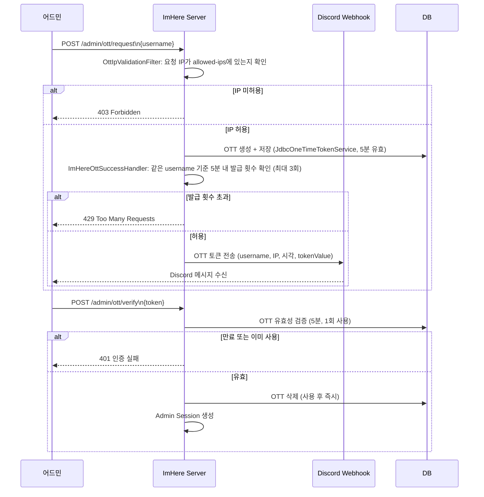

# Security

JWT/OIDC/Admin 인증 정책을 코드(`ImHereJwtProperties`, `SecurityConfig`, `OIDCVerifyService`, `ImHereOttSuccessHandler`) 기준으로 정리한다.

## OIDC (Kakao/Google) 연동

ImHere는 자체 비밀번호 체계가 없다. `users.provider` 컬럼은 DB enum상 `KAKAO`/`GOOGLE`/`NAVER` 세 값을 갖지만, 실제 `application-secret.yaml`에 설정이 있는 Provider는 **Kakao, Google 둘 뿐**이다 — `NAVER`는 코드상 도입되지 않은 예비 값이다.

| Provider | issuer | audience | JWKS |
|---|---|---|---|
| Kakao | `https://kauth.kakao.com` | Kakao REST API 키 | `https://kauth.kakao.com/.well-known/jwks.json` |
| Google | `https://accounts.google.com` | Google OAuth Client ID | `https://www.googleapis.com/oauth2/v3/certs` |

검증 흐름(`OIDCVerifyService` → `JjwtOIDCTokenVerifyAdapter`):
1. `provider`, `idToken`, `nonce`를 받는다. `nonce`가 비어 있으면 즉시 `AUTH-109` 거부.
2. JWKS에서 `kid`로 공개키를 찾아 서명을 검증한다(형식 오류 `AUTH-101`, 서명 실패 `AUTH-102`, 만료 `AUTH-100`).
3. payload의 `nonce`와 요청 `nonce`를 비교한다.
4. email 클레임을 추출한다(없으면 `AUTH-103`).

JWKS는 매 요청마다 외부 호출하지 않고 Provider별로 Redis에 캐싱한다(`kakaoOidcKeys::kakaoPublicKeySet`, `googleOidcKeys::googlePublicKeySet`). 라이브러리는 JJWT(`io.jsonwebtoken`)만 쓰고, 별도 OAuth2 Client 라이브러리는 사용하지 않는다.

## JWT

| 토큰 | 용도 | 만료 | 저장 위치 |
|---|---|---|---|
| Access Token | 일반 API 인증 | 720분(12시간) | 클라이언트 보관(서버 저장 없음) |
| Refresh Token | Access 재발급(`/api/auth/refresh`) | 7일 | **Redis** 키 `refresh:{email}`, 1개만 유지 — 재발급될 때마다 값이 교체(rotate)되어 이전 토큰은 즉시 무효화된다. MySQL에는 저장하지 않는다 |
| Admin Token | `/api/admin/**` 전용 | 60분 | 클라이언트 보관 |

- Refresh Token이 Redis에만 있다는 게 핵심이다 — 관리자가 그 키만 지우면 해당 사용자를 강제로 전체 로그아웃시킬 수 있다(`ForceLogoutService`).
- 역할: `ROLE_NORMAL`(일반), `ROLE_ADMIN`(관리자).

### SecurityFilterChain (3개 체인)

```
HTTP 요청
    ↓
JwtAuthenticationFilter      # Authorization 헤더 파싱 → SecurityContext 설정
    ↓
[Filter Chain 분기]
    Admin API   (Order 1) → ROLE_ADMIN + Session 또는 Admin JWT
    Admin Web   (Order 2) → OTT 로그인 페이지
    API         (Order 3) → /api/auth/** permitAll, 나머지 ROLE_USER + JWT
```

- Admin은 Session 기반 로그인 + Admin JWT를 병행한다(이중 보호). Admin 계정은 환경설정상 단일 계정(`admin.id`)이다 — 멀티 관리자 계정 구조가 아니다.

## Admin OTT (One-Time Token) 로그인

Admin은 비밀번호가 없다. `/admin/ott/request`로 사용자명만 보내면 Spring Security가 OTT를 만들어 Discord Webhook으로 전달하고, `/admin/ott/verify`에서 그 토큰으로 로그인한다.



**보안 장치:**
- IP 허용 목록 검사(`OttIpValidationFilter`)는 **IP 단위**다 — 허용/차단만 하고 횟수 제한은 없다.
- 발급 횟수 제한(5분/3회)은 `ImHereOttSuccessHandler`가 **관리자 username 단위**로 한다 — IP 기준이 아니다.
- 이 카운터는 애플리케이션 메모리(`ConcurrentHashMap`)에만 있다 — 인스턴스 재시작 시 초기화되고, 인스턴스가 여러 대면 인스턴스별로 따로 세서 제한이 무력화된다(현재는 단일 인스턴스라 해당 없음).

## FCM 토큰 보안

- 디바이스 토큰은 `email` + `deviceType` 기준으로 upsert 저장한다.
- Firebase가 `UNREGISTERED`를 반환하면 해당 토큰을 자동 삭제한다.

## 토큰 보안 원칙

- JWT `secret`은 환경변수/secret 파일로만 주입한다 — 코드에 하드코딩하지 않는다.
- JWT secret 노출 시: 환경변수 교체 → 전체 재배포(기존 모든 Access/Refresh 토큰 무효화됨).
- OTT Discord Webhook 노출 시: Webhook URL 재발급 → 환경변수 교체.
